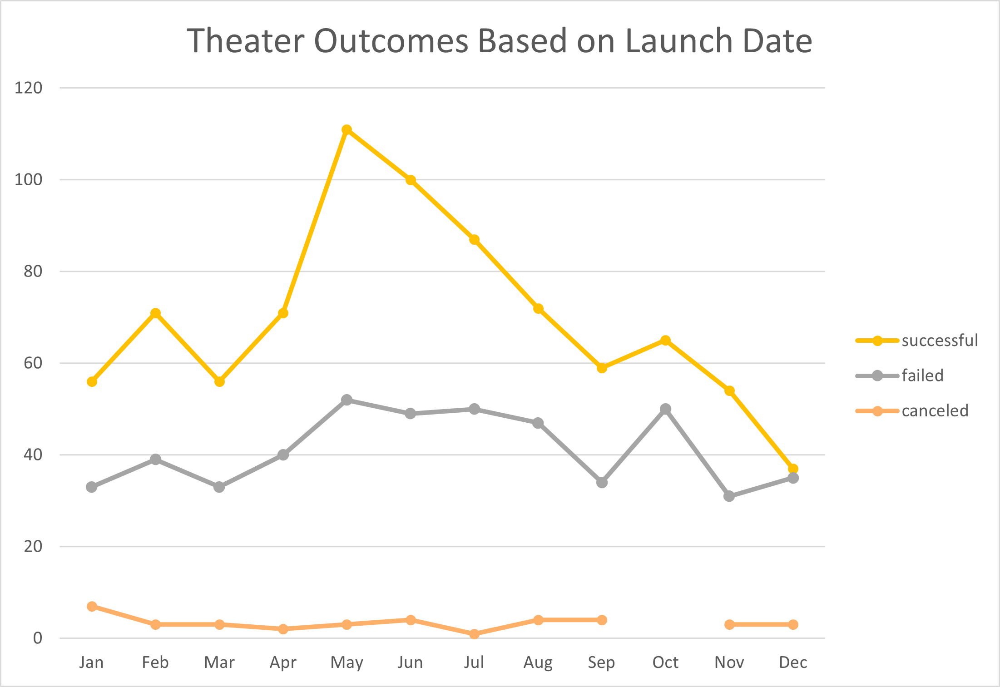
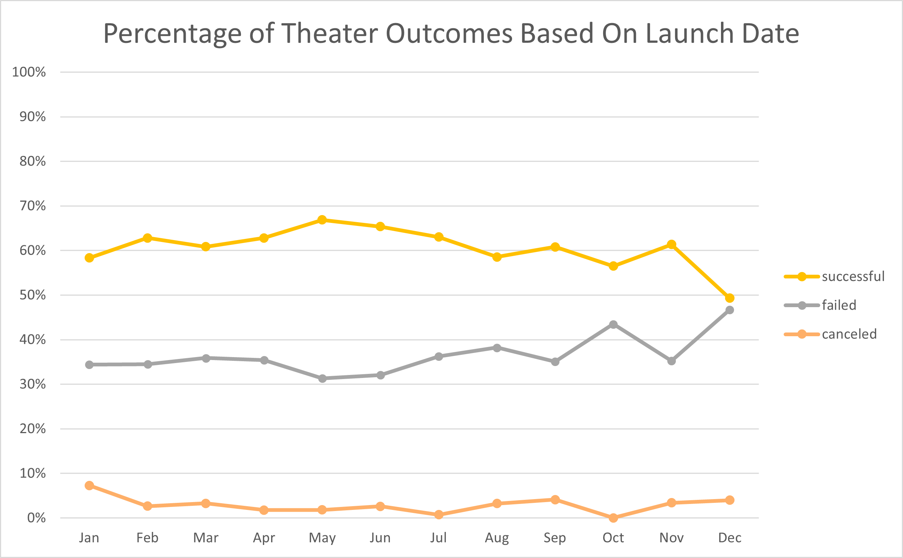
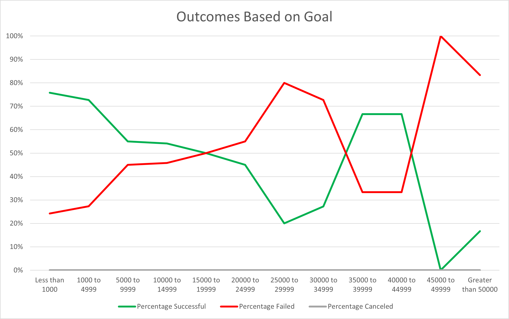

# Kickstarter-Analysis
Performing analysis on Kickstarter data to uncover trends

I.	Overview

Louise is an up-and-coming playwright who wants to start a crowdfunding campaign for her play, Fever. She is estimating a budget of $12,000 and is looking for insights from previous campaigns to help make her project successful.

II.	Purpose

This report provides a quantitative analysis of crowdfunding campaigns to help Louise plan her project accordingly. Throughout this paper, we will take a deep dive into factors that contribute to successful campaigns, including the best time to launch a campaign and the likelihood of reaching her goal of $12,000.

III.	Analysis and Challenges

A.	Outcomes Based on Launch Date

In Figure 1, a line chart was created detailing the outcomes of 1,369 theater campaigns based on their launch date. The noticeable spikes of successful outcomes in the months of May and June are present because more donations were received during these months. Campaigns launched in May and June generated 111 and 100 successful outcomes, respectively.

Figure 1: Timeline of 1,369 theater campaign outcomes

Figure 1 tells us that failed campaigns spiked at 52 in May and 50 in October. The challenge with this data is that it doesn’t consider the percentage of outcomes for any given month, which can be misleading if more campaigns were launched during certain time periods.

In Figure 2, the Month of May had the lowest percentage of failed campaigns at 31%. Failed campaigns spike at 43% in October, and 47% in December.

Figure 2: Percentage of theater campaign outcomes based on launch date

B.	Outcomes Based on Goal

Louise’s goal is to raise $12,000 for her play. Figure 3 displays the outcomes of successful and failed campaigns for plays organized by their fundraising goal. Those with a goal of $10,000 to $14,999 had a 54% success rate. Campaigns asking for less than $1,000 had the highest success rate of 76%, and 100% of campaigns asking between $45,000 and $49,999 failed. We do see a spike in successful campaigns asking between $35,000 and $44,999, but this data only considers 9 campaigns making it less reliable.

Figure 3: Percentage of play campaign outcomes based on fundraising goal

The challenge with pulling the data for Figure 3 was that writing the formulas and goal amounts was a somewhat manual process, making it more likely to create an error in the data.

IV.	Results

Based on the analysis of Theater Outcomes by Launch date, we can conclude that Louise should launch her campaign in May because it had the highest percentage of successful outcomes. Furthermore, she should avoid launching the campaign in October and December since campaigns in those months were the least successful.

Louise should also limit her fundraising goal to $12,000 and avoid increasing the goal throughout the campaign since the percentage of successful campaigns continue to drop as the goal amount increases. As campaign goals increase, our data becomes less reliable since the number of campaigns asking for more donations decrease.

The limitations of this dataset are that it doesn’t describe what methods were used to raise money and which demographics were targeted. For example, it doesn’t include whether donations were made online, through community events, or even bake sales. Furthermore, which demographic contributed the most to theater campaigns? Such an insight could help Louise maximize her donations by targeting specific groups or institutions.

Using the data provided, we can dive deeper into the duration of campaigns to determine if longer campaigns generated more donations, or if the goals of successful campaigns were met within a shorter time period. This would allow Louise to allocate her resources accordingly and decide, for example, if she needs to spread out her campaign to target recurring donors or focus on expanding her reach during a shorter time period.
